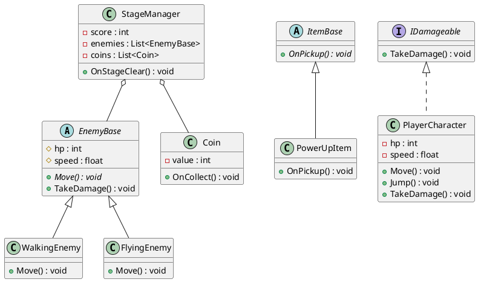
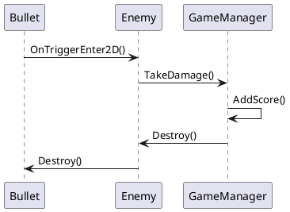

# 03 — UML 基礎（クラス図・シーケンス図）

## 1. UML とは

UML（Unified Modeling Language）は、ソフトウェアの設計を**図で表現するための標準的な記法**です。

コードだけでは「どのクラスがどのクラスを使っているか」「処理がどの順番で進むか」を
把握するのが難しくなります。図で可視化することで、チームメンバーが同じ設計イメージを
共有しやすくなります。

UML にはさまざまな図の種類がありますが、このドキュメントでは実務でよく使われる
以下の2種類に絞って説明します。

| 図の種類 | 何を表すか |
|---|---|
| **クラス図** | クラスの構造と関係（静的な設計） |
| **シーケンス図** | オブジェクト間のやり取りの流れ（動的な処理） |

> **ポイント：** UML は「完璧に描くこと」が目的ではありません。
> チームに設計の意図が**伝わること**が目的です。ラフでも構いません。

---

## 2. クラス図

### 2-1. クラス図の基本要素

クラスは以下のような3段の四角形で表現します。

```
+------------------------+
|   PlayerCharacter      |  ← クラス名
+------------------------+
| - hp : int             |  ← フィールド
| - speed : float        |
+------------------------+
| + Move() : void        |  ← メソッド
| + TakeDamage() : void  |
+------------------------+
```

フィールドとメソッドの前につく記号はアクセス修飾子を表します。

| 記号 | アクセス修飾子 |
|---|---|
| `+` | public |
| `-` | private |
| `#` | protected |

対応する C# コードは以下のとおりです。

```csharp
public class PlayerCharacter : MonoBehaviour
{
    private int   hp;       // - hp : int
    private float speed;    // - speed : float

    public void Move()       { } // + Move() : void
    public void TakeDamage() { } // + TakeDamage() : void
}
```

---

### 2-2. クラス間の関係の表現

クラス同士の関係は矢印の種類で区別します。

**継承（is-a）：空白の三角矢印が基底クラスを向く**

```
EnemyBase ◁────── WalkingEnemy
```

「WalkingEnemy は EnemyBase を継承している」を意味します。
**矢印は「子から親へ」向く**と覚えてください。

---

**インターフェース実装：点線 + 空白三角矢印**

```
IDamageable ◁ - - - PlayerCharacter
```

「PlayerCharacter は IDamageable を実装している」を意味します。

---

**集約（has-a）：空白ひし形が「持つ側」につく**

```
StageManager ◇────── Coin
```

「StageManager は Coin を持っている」を意味します。
◇（ひし形）が「持つ側」のクラスにつきます。

---

**依存：点線矢印**

```
PlayerCharacter - - -> ItemBase
```

「PlayerCharacter は処理の中で ItemBase を使う」を意味します。

---

### 2-3. 前章の設計をクラス図で表現する

[02_action-game-class-design.md](02_action-game-class-design.md) で設計したクラスを
クラス図として表現すると以下のようになります。
前章で整理した「クラスと関係の表」の答え合わせとして確認してください。

```
+------------------+          +------------------+
|  《abstract》    |          |  《abstract》    |
|   EnemyBase      |          |   ItemBase       |
+------------------+          +------------------+
| # hp : int       |          +------------------+
| # speed : float  |          | + OnPickup()     |
+------------------+          +------------------+
| + Move()         |                  ◁
| + TakeDamage()   |                  |
+------------------+          +------------------+
        ◁                     |   PowerUpItem    |
        |                     +------------------+
   ┌────┴────┐                | + OnPickup()     |
   |         |                +------------------+
+----------+ +----------+
|WalkingEnemy| |FlyingEnemy|
+----------+ +----------+
| + Move() | | + Move() |
+----------+ +----------+


+------------------+     ◇──── EnemyBase（リスト）
|  StageManager    |
+------------------+     ◇──── Coin（リスト）
| - score : int    |
+------------------+    +------------------+
| + OnStageClear() |    |      Coin        |
| + OnGameOver()   |    +------------------+
+------------------+    | - value : int    |
                         +------------------+
                         | + OnCollect()    |
                         +------------------+


+------------------------+
|   PlayerCharacter      |
+------------------------+
| - hp : int             |
+------------------------+
| + Move() : void        |
| + Jump() : void        |        《interface》
| + TakeDamage() : void  |  - - ▷ IDamageable
+------------------------+
```

> **補足：** テキストアートでは複雑な図は表現しにくくなります。
> 次の 2-4 で紹介する PlantUML を使うと、より整った図を簡単に作れます。

---

### 2-4. PlantUML でクラス図を書く

PlantUML はテキストのコードから UML 図を自動生成するツールです。
オンラインエディタにコードを貼り付けるだけで図が生成されます。

- PlantUML 公式：https://plantuml.com/ja/
- オンラインエディタ：https://www.plantuml.com/plantuml/uml/

以下のコードをオンラインエディタに貼り付けると、前章のクラス設計がクラス図として表示されます。



---

## 3. シーケンス図

### 3-1. シーケンス図とは

シーケンス図は「**オブジェクト間のメッセージのやり取りを時系列で表現する図**」です。

| 比較 | クラス図 | シーケンス図 |
|---|---|---|
| 何を表すか | クラスの構造・関係（静的） | 処理の流れ・順番（動的） |
| 使うタイミング | 設計の全体像を共有するとき | 複雑な処理の順番を確認するとき |

クラス図だけでは「どのメソッドがいつ・どの順番で呼ばれるか」はわかりません。
シーケンス図を併用することで、処理の流れをチーム内で確認できます。

---

### 3-2. シーケンス図の基本要素

```
  PlayerCharacter      EnemyBase        StageManager
        |                   |                 |
        |── TakeDamage() ──>|                 |
        |                   |── OnDeath() ───>|
        |                   |                 |── UpdateScore()
        |                   |                 |
```

| 要素 | 表現 | 意味 |
|---|---|---|
| **ライフライン** | 縦の破線（`|`） | オブジェクトの存在期間 |
| **メッセージ** | 横の実線矢印（`──>`） | メソッドの呼び出し |
| **戻り値** | 横の点線矢印（`- - >`） | 返却値 |

図は**上から下へ時間が流れます**。
左から右への配置は「処理を始める側」から書くとわかりやすくなります。

---

### 3-3. スペースシューターの処理をシーケンス図で表現

「弾がエネミーに当たってスコアが加算されるまでの流れ」をシーケンス図で表現します。

```
    Bullet              Enemy            GameManager
      |                   |                   |
      |  OnTriggerEnter2D |                   |
      |──────────────────>|                   |
      |                   |   TakeDamage()    |
      |                   |──────────────────>|
      |                   |                   | AddScore()
      |                   |                   |
      |                   |   Destroy()       |
      |                   |<──────────────────|
      |   Destroy()       |                   |
      |<──────────────────|                   |
      |                   |                   |
```

---

### 3-4. PlantUML でシーケンス図を書く

以下のコードをオンラインエディタに貼り付けると、上記のシーケンス図が生成されます。



---

## 4. よくあるハマりどころ

**クラス図を完璧に描こうとして時間がかかりすぎる**

クラス図はラフで構いません。すべてのフィールドとメソッドを書かなくても、
「この設計で話し合いができる」レベルで十分です。
目的は「伝わること」であり「完璧な図を描くこと」ではありません。

**継承と集約の矢印の向きを混同する**

- 継承（◁）：「子から親へ」向く。WalkingEnemy → EnemyBase の方向。
- 集約（◇）：ひし形が「持つ側」につく。StageManager ◇── Coin の方向。

「継承は子が親を指す」「集約はひし形が持ち主」と覚えると混同しにくくなります。

**シーケンス図の左右の配置に迷う**

処理を**始める側（呼び出す側）を左**に配置すると読みやすくなります。
「誰が最初に動き出すか」を起点にして左から並べていきましょう。

---

## 5. 04_space-shooter/ への接続

`04_space-shooter/` の設計書テンプレート（`design-template.md`）では、
このドキュメントで学んだクラス図とシーケンス図を使って設計を表現します。

PlantUML のオンラインエディタで図を作成し、`design-template.md` に
PlantUML コードとして貼り付けることを推奨します。
「完璧な図」ではなく「チームに伝わる図」を目指してください。

---

## 参考リンク

- [PlantUML 公式](https://plantuml.com/ja/)
- [PlantUML オンラインエディタ](https://www.plantuml.com/plantuml/uml/)
- [03_design/02_action-game-class-design.md](02_action-game-class-design.md) — クラス設計ワーク（前章）
- [04_space-shooter/design-template.md](../04_space-shooter/design-template.md) — 設計書テンプレート（次の活用先）
