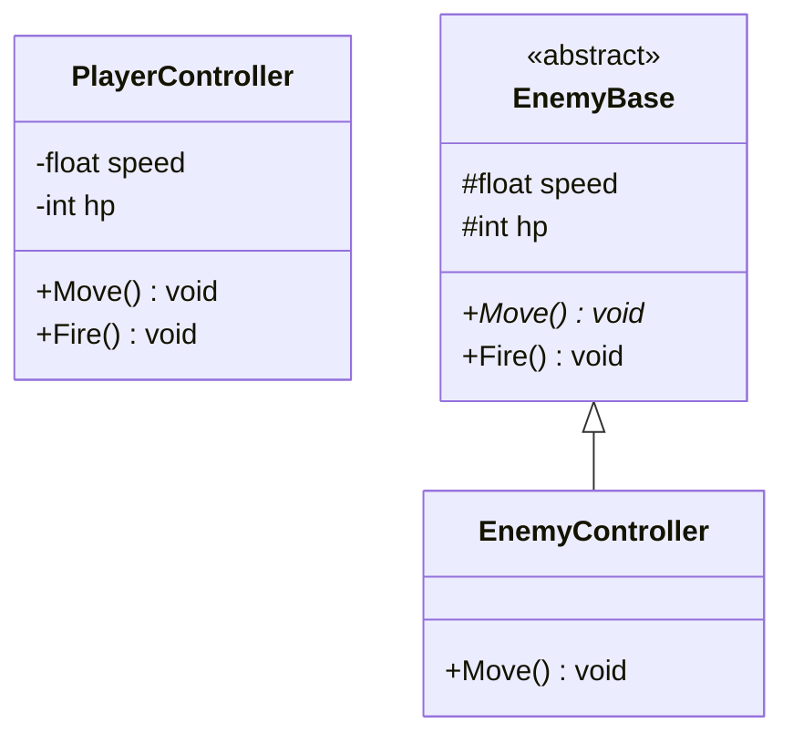
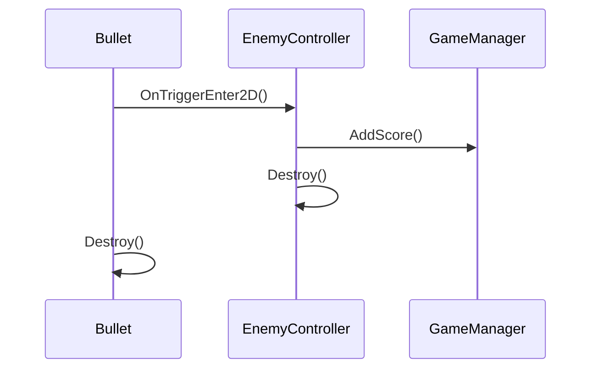

# 設計書テンプレート — スペースシューター

## このテンプレートの使い方

このファイルは直接編集せず、同じフォルダに `my-design.md` などの名前でコピーしてから記入してください。

記入の心構えとして、以下を意識しながら進めてください。

- 完璧な設計を目指す必要はありません。まず自分の考えで書いてみることが大切です。
- 実装しながら設計を更新していくことを推奨します。設計書は「完成品」ではなく「作業中のメモ」として使ってください。
- 「なぜそう設計したか」の理由も書いておくと、振り返りのときに役立ちます。

---

## 1. ゲーム概要（確認用）

詳細な仕様は [README.md](README.md) を参照してください。

**プレイヤー**
- 画面下部を左右に移動できます。
- スペースキー（または任意のキー）で弾を発射できます。
- 敵の弾または敵本体に当たるとゲームオーバーです。

**敵**
- 複数体が横一列に並んで登場します。
- 左右に移動し、端に達すると下に降りてきます。
- 一定間隔でランダムに弾を発射します。
- プレイヤーの弾に当たると消滅します。

**弾**
- プレイヤーの弾：上方向に移動します。
- 敵の弾：下方向に移動します。
- 画面外に出たら消滅します。

**ゲームの進行**
- 敵を全滅させるとステージクリアです。
- 敵が画面下部まで到達するとゲームオーバーです。
- スコアを画面に表示します。

---

## 2. 登場要素の洗い出し

このゲームに登場するものをすべて書き出してください。
画面上に見えるものだけでなく、ゲームを動かすために必要な「見えない仕組み」も考えてみましょう。

| 要素名 | 説明 |
|---|---|
| （例）プレイヤー | 左右に移動して弾を発射するキャラクター |
| （例）敵 | 横移動しながら降りてくるキャラクター |
| | |
| | |
| | |

---

## 3. クラス一覧

洗い出した要素をクラスとして定義してください。
「何を持つか（フィールド）」と「何をするか（メソッド）」を考えてみましょう。

| クラス名 | 責務 | 主なフィールド | 主なメソッド |
|---|---|---|---|
| （例）PlayerController | プレイヤーの移動・射撃を制御する | speed, hp | Move(), Fire() |
| （例）EnemyController | 敵の移動・射撃を制御する | speed, hp | Move(), Fire() |
| | | | |
| | | | |
| | | | |
| | | | |

> **ヒント：**
> - 似た責務を持つクラスは基底クラスにまとめられないか考えてみましょう。
> - 「1クラス1責務」を意識してください。
> - 参考：[03_design/01_solid-principles.md](../03_design/01_solid-principles.md)

---

## 4. クラス間の関係

クラス同士の関係を整理してください。

**関係の種類：** 継承（is-a）／ 集約（has-a）／ インターフェース実装 ／ 依存

| クラスA | 関係の種類 | クラスB | 説明 |
|---|---|---|---|
| （例）EnemyController | 継承（is-a） | EnemyBase | 敵の共通処理を基底クラスに集約する |
| （例）GameManager | 集約（has-a） | EnemyController（リスト） | 全敵を管理する |
| | | | |
| | | | |
| | | | |

---

## 5. クラス図

Mermaid または PlantUML でクラス図を描いてください。
ラフな図で構いません。「伝わること」を優先してください。
参考：[03_design/03_uml-basics.md](../03_design/03_uml-basics.md)

以下は記入例です（PlayerController・EnemyBase・EnemyController の関係）。

（ここに自分のクラス図を記入）

---

## 6. シーケンス図

主要な処理の流れをシーケンス図で描いてください。
以下のシナリオのうち1つ以上を描いてみましょう。

- A. 弾が敵に当たったときの処理
- B. 敵が画面端に達したときの処理
- C. ゲームオーバーになったときの処理

以下はシナリオ A の記入例です。

（ここに自分のシーケンス図を記入）

---

## 7. 採用するデザインパターン（任意）

[03_design/04_design-patterns.md](../03_design/04_design-patterns.md) を参考に、使えそうなパターンがあれば記入してください。
使わなくても問題ありません。

| パターン名 | 使う場所 | 採用理由 |
|---|---|---|
| （例）Object Pool | 弾の生成・破棄 | 頻繁な Instantiate/Destroy を避けるため |
| （例）Singleton | GameManager | シーン全体で1つだけ存在させるため |
| | | |
| | | |

---

## 8. 懸念点・未解決の問題（任意）

設計段階で迷った点や、実装前に解決できていない問題を書いておきましょう。
実装後に振り返るときの参考になります。

（例）敵の弾とプレイヤーの弾を別クラスにすべきか、1クラスにまとめるべきか迷っている。

---

（ここに懸念点を記入）

---

---

## 9. 実装後の振り返りメモ（後から記入）

実装が終わったら以下を記入してください。
詳細な振り返りは [05_reflection/retrospective-template.md](../05_reflection/retrospective-template.md) を使ってください。

### 設計通りに進められた点

---

（ここに記入）

---

---

### 設計から変更した点と理由

| 変更内容 | 変更理由 |
|---|---|
| | |
| | |
| | |

---

### 次回の設計に活かしたいこと

---

（ここに記入）

---
