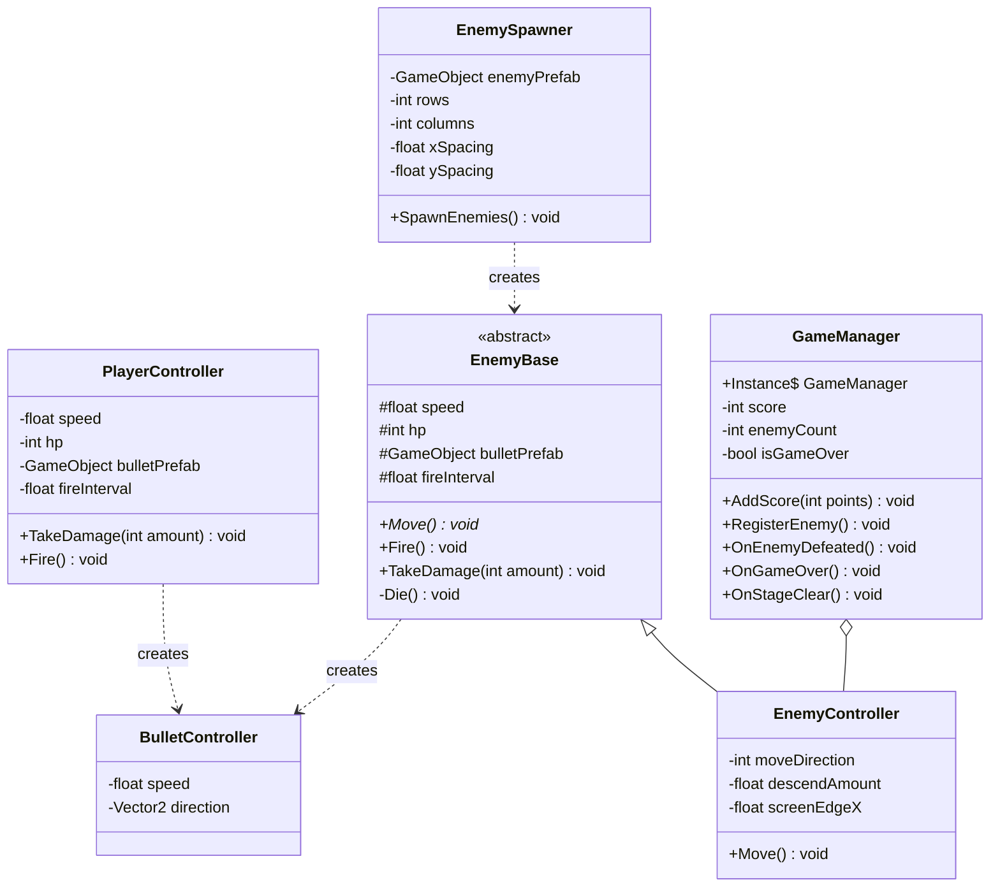
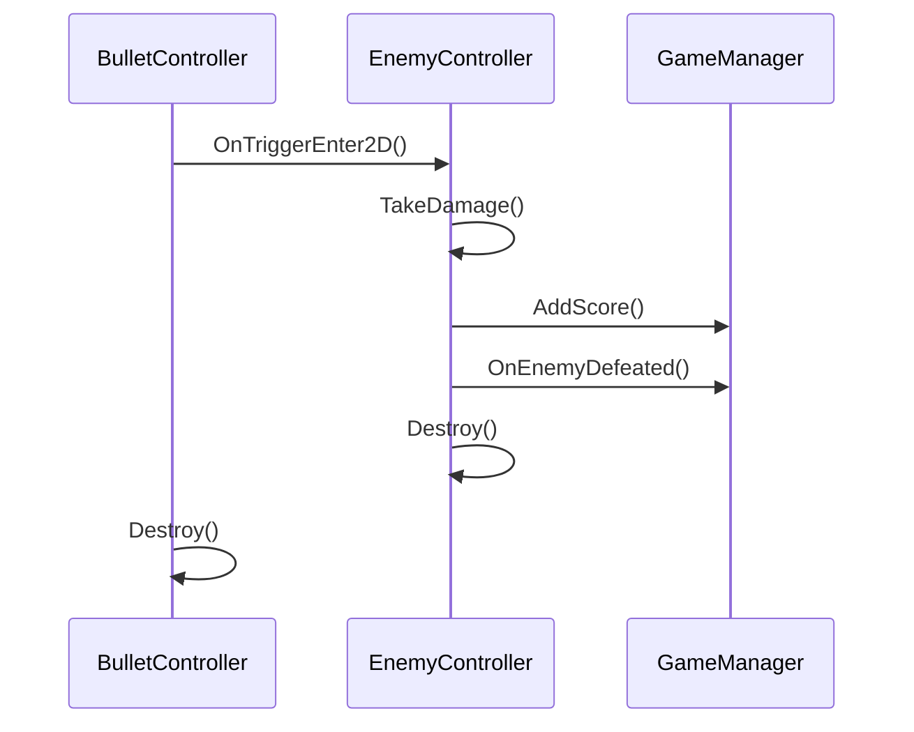
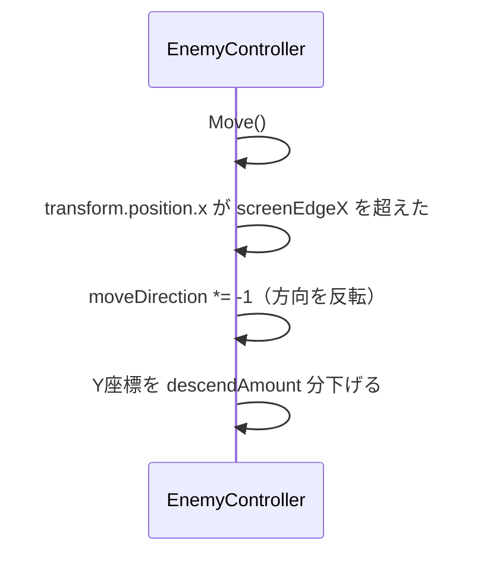

# 模範解答 設計ドキュメント — スペースシューター

## 1. このドキュメントについて

このドキュメントは、スペースシューター課題の模範解答における設計の一例です。
**唯一の正解ではありません。** 設計にはさまざまなアプローチがあります。

自分の設計と比較して「なぜ違う設計にしたか」「自分のアプローチの方が優れている点はどこか」を
考えることが学びになります。模範解答と異なっていても、動作していれば問題ありません。

---

## 2. 登場要素の洗い出し（解答例）

| 要素名 | 説明 |
|---|---|
| プレイヤー | 左右に移動して弾を発射するキャラクター |
| 敵（基底） | 移動・射撃の共通処理を持つ抽象クラス |
| 通常の敵 | 左右に移動し、端に達すると降りてくるキャラクター |
| プレイヤーの弾 | 上方向に移動して敵に当たると消える |
| 敵の弾 | 下方向に移動してプレイヤーに当たると消える |
| ゲームマネージャー | スコア管理・ゲームオーバー・ステージクリアを担当 |
| 敵スポナー | 敵を格子状に一括生成する |

---

## 3. クラス一覧（解答例）

| クラス名 | 責務 | 主なフィールド | 主なメソッド |
|---|---|---|---|
| `PlayerController` | プレイヤーの移動・射撃・HP管理 | speed, hp, bulletPrefab, fireInterval | Move(), Fire(), TakeDamage() |
| `EnemyBase`（抽象） | 敵の共通処理（射撃・HP管理） | speed, hp, bulletPrefab, fireInterval | Move()※abstract, Fire(), TakeDamage() |
| `EnemyController` | 左右移動・端での折り返し・降下 | moveDirection, descendAmount, screenEdgeX | Move()※override |
| `BulletController` | 弾の移動・画面外での自動消滅 | speed, direction | （Update で移動・OnTriggerEnter2D で消滅） |
| `GameManager` | スコア管理・ゲームオーバー・クリア | Instance, score, enemyCount, isGameOver | AddScore(), RegisterEnemy(), OnEnemyDefeated(), OnGameOver(), OnStageClear() |
| `EnemySpawner` | 敵を格子状に一括生成する | enemyPrefab, rows, columns, xSpacing, ySpacing | SpawnEnemies() |

---

## 4. クラス間の関係（解答例）

| クラスA | 関係の種類 | クラスB | 説明 |
|---|---|---|---|
| `EnemyController` | 継承（is-a） | `EnemyBase` | 移動処理を具体化した派生クラス |
| `GameManager` | Singleton | （自己参照） | シーン全体で1インスタンスを保証 |
| `EnemySpawner` | 依存 | `EnemyBase` | 敵インスタンスを生成する |
| `PlayerController` | 依存 | `BulletController` | 弾インスタンスを生成する |
| `EnemyBase` | 依存 | `BulletController` | 弾インスタンスを生成する |
| `GameManager` | 集約（has-a） | `EnemyController`（リスト） | 敵の残数を管理する |

---

## 5. クラス図（解答例）

---

## 6. シーケンス図（解答例）

### シナリオ A：弾が敵に当たったときの処理

### シナリオ B：敵が画面端に達したときの処理

---

## 7. 採用したデザインパターン

| パターン | 使った場所 | 採用理由 |
|---|---|---|
| Singleton | `GameManager` | スコアやゲーム状態はシーン全体で1つだけ管理すれば十分なため |
| Object Pool（コメントのみ） | `BulletController` | 弾の頻繁な Instantiate/Destroy による GC 負荷への対策として言及。Unity 2021 以降は `UnityEngine.Pool.ObjectPool<T>` が使用可能 |

---

## 8. 設計時の判断メモ

- **`EnemyBase` を抽象クラスにした理由：** 敵の種類が増えることを想定して `Move()` のみを `abstract` にし、`Fire()` と `TakeDamage()` は共通実装を `EnemyBase` に持たせました。新しい敵タイプを追加する場合は `Move()` だけ実装すれば済みます（開放閉鎖の原則）。

- **`BulletController` を1クラスにした理由：** プレイヤーの弾と敵の弾は `direction` フィールドで上下を切り替えられるため、共通化しました。弾の種類が増えた場合（貫通弾・追尾弾など）は、基底クラスへの分割を検討します。

- **`GameManager` を Singleton にした理由：** スコアや敵の残数・ゲームオーバー状態は `PlayerController`・`EnemyController`・`EnemySpawner` など複数のクラスから参照される共通状態であるため、Singleton で一元管理しました。

- **`EnemySpawner` を分離した理由：** 敵の生成処理を `GameManager` に持たせると、ゲーム進行管理と生成処理の2つの責任を持つことになります（単一責任の原則の違反）。`EnemySpawner` として分離することで、ウェーブ管理の拡張も容易になります。
